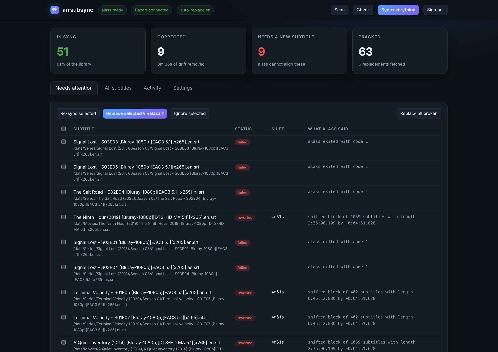
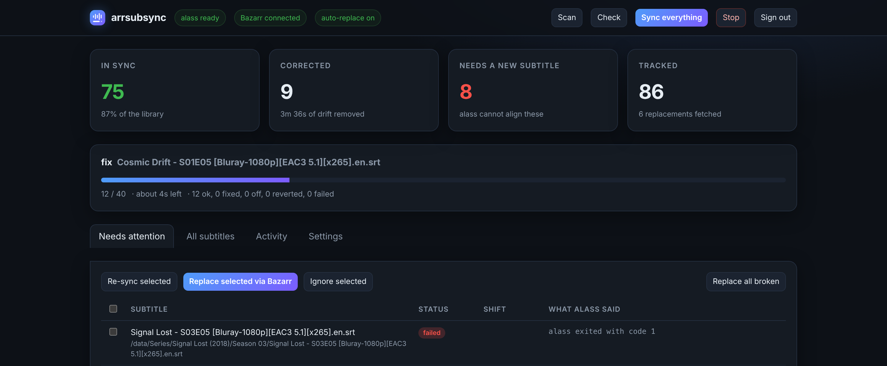
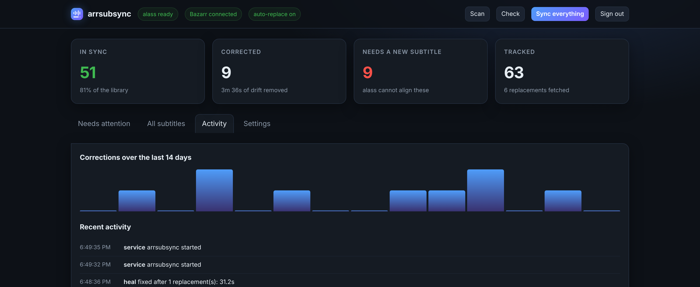
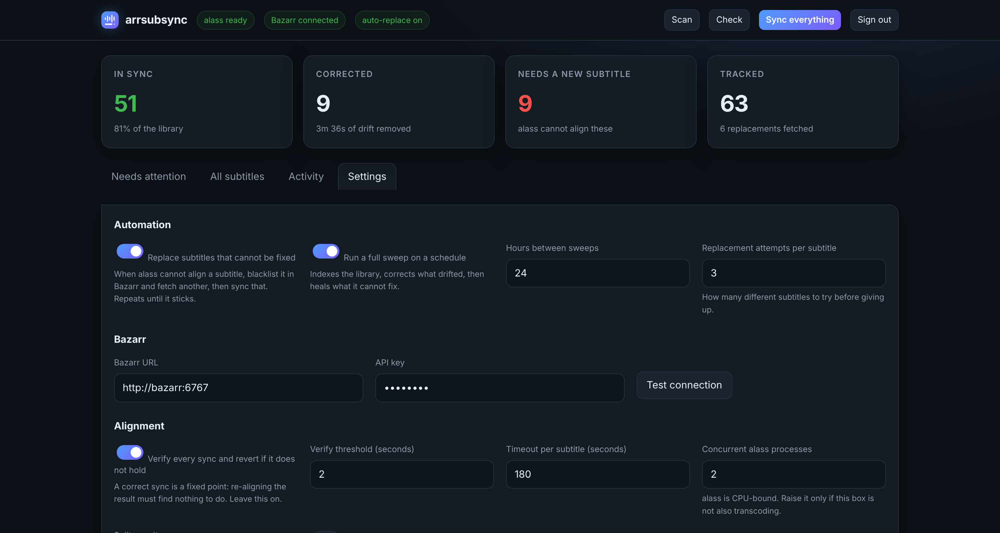
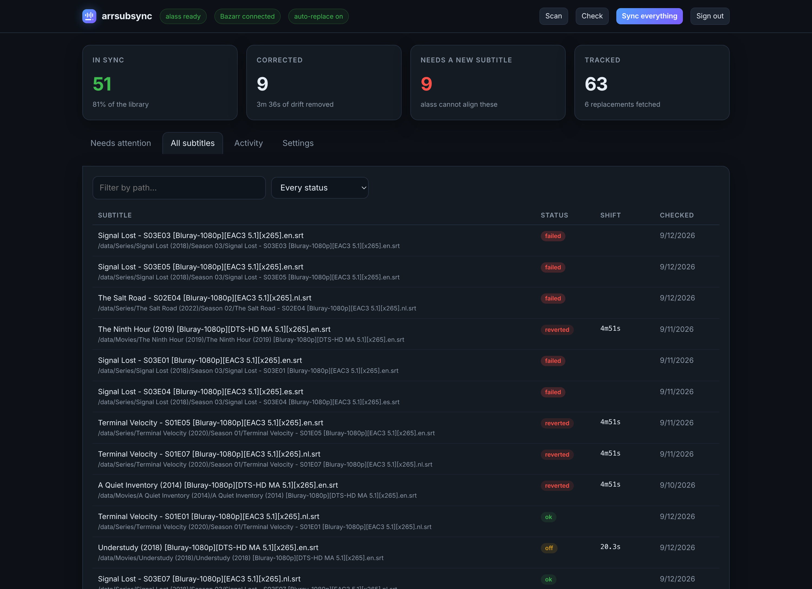

<div align="center">


**Your subtitle library, permanently in sync.**

Checks every subtitle against the actual audio, re-aligns the ones that drifted,
and automatically replaces the ones that can't be fixed — then proves its own work.

[](https://github.com/sitolam/arrsubsync/actions/workflows/ci.yml)
[](https://github.com/sitolam/arrsubsync/actions/workflows/docker.yml)
[](https://github.com/sitolam/arrsubsync/pkgs/container/arrsubsync)
[](LICENSE)

</div>

---

## What it does

Drop it next to Bazarr in your `*arr` stack and it takes subtitle timing off your hands:

| | |
| --- | --- |
| **Re-aligns on download** | Bazarr's post-processing hook calls it; every subtitle that arrives is aligned to the audio before you ever watch it. |
| **Sweeps your whole library** | One command, or a schedule, checks everything you already have. |
| **Proves each correction** | A correct sync is a *fixed point*. It re-aligns its own result, and if that doesn't hold, it puts the original back. |
| **Replaces what it can't fix** | Some subtitles belong to a different cut and no alignment exists. It blacklists them in Bazarr, fetches another, syncs that, and repeats until one sticks. |
| **Shows you everything** | A dashboard with live progress, per-file status, history, and settings — behind a login. |

<p align="center">
  
</p>

It uses [**alass**](https://github.com/kaegi/alass) (Automatic Language-Agnostic
Subtitle Synchronization) for the alignment itself. All the judgement about
*whether an alignment is trustworthy*, the library sweeps, the Bazarr integration
and the dashboard are what arrsubsync adds on top.

<div align="center">

```
┌──────────┐   subtitle downloaded    ┌──────────────┐   reads audio   ┌─────────┐
│  Bazarr  │ ───────────────────────▶ │  arrsubsync  │ ──────────────▶ │  alass  │
└──────────┘                          └──────────────┘                 └─────────┘
      ▲                                      │  verifies the result, reverts if it fails
      └──── "this one is unusable,  ─────────┘
             blacklist it and find me another"
```

</div>

---

## Why not Bazarr's built-in sync?

Bazarr ships **ffsubsync**, which fits one global offset between subtitle and audio.
That works when a subtitle is uniformly early or late, and fails when it isn't:

- **Non-constant drift** — a subtitle cut for a different release (extra recap, different
  ad breaks, a PAL speed-up, an extended cut) drifts by a different amount in each act.
  One offset cannot fix all of them.
- **Wrong audio track** — if the chosen track is commentary or a dub, the fitted offset is noise.

**alass** solves a harder problem: dynamic-programming alignment that may *split* the
timeline into segments, each shifted independently, with a penalty discouraging
gratuitous splits. It absorbs ad breaks and inserted scenes instead of averaging them
into one bad offset, and it is language-agnostic — it matches speech activity, not words,
so a Dutch subtitle aligns against English audio perfectly well.

And the part neither tool does on its own: **knowing when the result is wrong.**
See [Trust, and how it is earned](#trust-and-how-it-is-earned).

---

## Quick start

```yaml
  arrsubsync:
    image: ghcr.io/sitolam/arrsubsync:latest
    container_name: arrsubsync
    restart: unless-stopped
    environment:
      ARRSUBSYNC_PASSWORD: choose-something
    volumes:
      - ./arrsubsync:/config
      - /mnt/media:/data      # ← the same media mount Bazarr uses
    ports:
      - 8765:8765
    networks:
      - media                 # ← the network Bazarr is on
```

```bash
docker compose up -d arrsubsync
```

Open **http://your-server:8765**, sign in as `admin`, and on the **Settings** tab fill in
your Bazarr URL and API key (Bazarr → Settings → General). Press **Test connection**.

Then in **Bazarr → Settings → Subtitles → Custom Post-Processing**, tick it on and paste
this into **Command**:

```
curl -sS --max-time 300 -X POST http://arrsubsync:8765/sync -H Content-Type:application/json -d '{"video": {{episode}}, "subtitle": {{subtitles}}}'
```

> **Don't add quotes around the variables.** Bazarr wraps each `{{variable}}` in double
> quotes itself and strips any you add — see [Wiring into Bazarr](#wiring-into-bazarr).

Finally, press **Sync everything** on the dashboard to bring your existing library in line.
That's the whole setup.

---

## The dashboard

| Tab | What's there |
| --- | --- |
| **Overview** | How much of the library is verified in sync, how many corrections have been made and how much total drift that removed, how many subtitles need replacing, and a live progress bar for whatever is running. |
| **Needs attention** | Every subtitle that is out of sync, was reverted, or failed — with what alass said about each. Select some and re-sync, replace via Bazarr, or ignore them. |
| **All subtitles** | The whole library, filterable by status and path. |
| **Activity** | Corrections per day, and a live feed of everything that happened. |
| **Settings** | Automation, Bazarr, alignment tuning, and library filters. |

<table>
  <tr>
    <td width="50%"><br>
      <sub><b>Live progress.</b> Every job reports what it is working on, how far along it is, and what it has found so far — with a Stop button.</sub></td>
    <td width="50%"><br>
      <sub><b>History.</b> Corrections per day, and a feed of every sync, revert and replacement.</sub></td>
  </tr>
  <tr>
    <td><br>
      <sub><b>Settings.</b> Automation, Bazarr credentials, alignment tuning and library filters — each explained in place.</sub></td>
    <td><br>
      <sub><b>The whole library.</b> Filter by status or path, and see what alass said about any subtitle.</sub></td>
  </tr>
</table>

Authentication is a single account with a PBKDF2-hashed password and a signed session
cookie. Set `ARRSUBSYNC_PASSWORD` in compose, or leave it out and choose one on first
visit. `ARRSUBSYNC_NO_AUTH=true` disables the login entirely — reasonable only if the
port is not published.

---

## Automatic mode

Turn on **Replace subtitles that cannot be fixed** and **Run a full sweep on a schedule**,
and the loop below runs without you:

1. **Index** the library — every video with subtitles beside it.
2. **Check and correct** anything that drifted, verifying each correction.
3. **Heal** what could not be aligned:
   - Blacklist that subtitle in Bazarr, which deletes it and starts a fresh search.
     Blacklisting matters: it stops the provider handing back the same file.
   - Wait for the replacement to land, sync it, verify it.
   - Not right either? Try again, up to **Replacement attempts per subtitle** (default 3),
     then mark it as needing a human and move on.

Nothing loops forever, and nothing is left half-applied: a subtitle is either improved or
byte-for-byte what it was.

The same healing fires for a single file when Bazarr's hook reports one it cannot fix, so
a bad download tends to fix itself within a couple of minutes.

---

## Trust, and how it is earned

This is the part that matters, and the reason this project exists rather than a shell script.

A sync that *looks* clean can be completely wrong. A real example from the library this was
built against — a film's subtitle aligned against a **Special Cut** remux:

```
sync   : shifted block of 1059 subtitles by -0:00:29.152     ← looks perfect
verify : shifted block of 1059 subtitles by -0:04:51.628     ← it isn't
```

One tidy-looking block, a plausible 29-second shift. But re-aligning the *result* asks for
another 4m51s, because the subtitle was timed for the theatrical cut and no single
alignment exists. Applying that damages the subtitle. Applying it *again* damages it more,
because alass is then realigning its own bad output — which is exactly how a file ends up
minutes out and unrecoverable.

So every sync that touches a file is verified:

- The original is copied aside before the replacement.
- alass is run again against the result.
- If the second pass wants to move it more than **Verify threshold** (default 2s), the
  original is restored and the caller gets `409 reverted` with the residual named.

```json
{
  "status": "reverted",
  "error": "alass did not converge: after syncing it wanted to move the subtitle by another 4m51s. The subtitle does not match this audio, so the original was restored.",
  "alass_summary":  "shifted block of 1059 subtitles ... by -0:00:29.152",
  "verify_summary": "shifted block of 1059 subtitles ... by -0:04:51.628"
}
```

A reverted subtitle isn't a failure of the system — it's the system refusing to make things
worse, and handing the file to the replacement loop instead.

**Reading a summary line:**

| What you see | What it means |
| --- | --- |
| One block, near-zero shift | Already correct. |
| One block, a real shift | A clean constant offset — the ideal case. |
| A few blocks, similar shifts | Framerate drift, correctly absorbed. |
| Blocks disagreeing by minutes | No coherent alignment. Expect a revert. |

---

## Wiring into Bazarr

**Settings → Subtitles → Custom Post-Processing** → tick it → **Command**:

```
curl -sS --max-time 300 -X POST http://arrsubsync:8765/sync -H Content-Type:application/json -d '{"video": {{episode}}, "subtitle": {{subtitles}}}'
```

Two details behind that line, both verified against Bazarr's source:

- **`pp_replace()` strips quotes around a variable and adds its own.** `{{episode}}` expands
  to `"/data/Movies/Foo/Foo.mkv"`, quotes included, so the command above becomes valid JSON.
  Adding your own quotes breaks it.
- **On Linux the command runs through `shlex.split()` with `shell=False`.** There is no
  shell: `&&`, `|`, `>`, `$VAR` and globs do not work, and the header is written unquoted
  on purpose (`shlex` would otherwise keep the quotes literal and curl would send a
  malformed header name).

While you are there, untick **Enable Automatic Subtitles Audio Synchronization** — that is
ffsubsync, and letting it align first only gives alass a worse starting point.

<details>
<summary><b>Every variable Bazarr provides</b></summary>

`{{directory}}`, `{{episode}}` (the **video** path, for movies too), `{{episode_name}}`,
`{{subtitles}}` (the subtitle path), `{{subtitles_language}}`, `{{subtitles_language_code2}}`,
`{{subtitles_language_code3}}`, `{{subtitles_language_code2_dot}}`,
`{{subtitles_language_code3_dot}}`, `{{episode_language}}`, `{{episode_language_code2}}`,
`{{episode_language_code3}}`, `{{score}}`, `{{subtitle_id}}`, `{{provider}}`, `{{uploader}}`,
`{{release_info}}`, `{{series_id}}`, `{{episode_id}}` — each substituted already-quoted.

</details>

<details>
<summary><b>If curl is missing from your Bazarr image</b></summary>

Check with `docker exec bazarr sh -c 'command -v curl; command -v wget'`. With only wget:

```
wget -q -O - --timeout=300 --header=Content-Type:application/json --post-data '{"video": {{episode}}, "subtitle": {{subtitles}}}' http://arrsubsync:8765/sync
```

Or install curl persistently with the LinuxServer mod: `DOCKER_MODS=linuxserver/mods:universal-package-install`
and `INSTALL_PACKAGES=curl` on the bazarr service.

</details>

---

## Command line

Everything the dashboard does is available without it:

```bash
docker exec arrsubsync python -m app.cli status   # what the database knows
docker exec arrsubsync python -m app.cli scan     # index the library
docker exec arrsubsync python -m app.cli check    # check everything, change nothing
docker exec arrsubsync python -m app.cli fix      # check and correct
docker exec arrsubsync python -m app.cli heal     # replace what cannot be aligned
docker exec arrsubsync python -m app.cli full     # all three, in order
```

```
[412/527] 318 ok, 74 fixed, 9 reverted eta 6m12s  Foo (2019).en.srt
fix finished: 318 ok, 74 fixed, 9 reverted, 2 failed
```

Add paths to limit a run, `--root` to walk one folder, `--workers` to set concurrency, and
`--json` for machine-readable totals. The exit code is non-zero when anything was reverted
or failed, so it works as a cron check.

---

## Settings

Everything is editable in the dashboard; the environment variables seed the defaults.

| Setting | Env | Default | What it does |
| --- | --- | --- | --- |
| Media root | `MEDIA_ROOT` | `/data` | Every path must resolve inside this |
| Data directory | `ARRSUBSYNC_DATA` | `/config` | Database, settings, session secret |
| Password | `ARRSUBSYNC_PASSWORD` | — | Dashboard login; unset means choose on first visit |
| Disable auth | `ARRSUBSYNC_NO_AUTH` | `false` | Only sensible when the port is unpublished |
| Verify after sync | `ARRSUBSYNC_VERIFY_AFTER` | `true` | The safety net. Leave it on |
| Verify threshold | `ARRSUBSYNC_VERIFY_THRESHOLD` | `2.0`s | Residual shift that still counts as converged |
| Auto-replace | `ARRSUBSYNC_AUTO_REPLACE` | `false` | Heal unfixable subtitles through Bazarr |
| Attempts | `ARRSUBSYNC_MAX_ATTEMPTS` | `3` | Replacement subtitles to try before giving up |
| Schedule | `ARRSUBSYNC_SCHEDULE` | `false` | Run a full sweep periodically |
| Schedule hours | `ARRSUBSYNC_SCHEDULE_HOURS` | `24` | How often |
| Concurrency | `MAX_CONCURRENCY` | `2` | Parallel alass processes — it is CPU-bound |
| Timeout | `ALASS_TIMEOUT` | `180`s | Per subtitle, then it is killed |
| Split penalty | `ALASS_SPLIT_PENALTY` | alass's 7 | Higher keeps the timeline in one piece (5–20 useful) |
| Offset only | `ALASS_NO_SPLITS` | `false` | Fast, cannot scatter cues, will not absorb drift |
| Skip tags | `ARRSUBSYNC_SKIP_TAGS` | `forced` | Subtitle tags to leave alone |
| Languages | `ARRSUBSYNC_LANGUAGES` | all | e.g. `en,nl` |
| Backups | — | on | A pristine copy of every subtitle before its first change |
| Bazarr | `BAZARR_URL`, `BAZARR_API_KEY` | — | Needed for replacement |

---

## API

`POST /sync` — the hook. `{"video": "...", "subtitle": "...", "dry_run": false}`, plus optional
`split_penalty`, `no_splits`, `speed_optimization`, `verify_after`, `verify_threshold`.
Returns `200` synced, `409` reverted, `400` bad path, `502` alass failed.

`GET /health` — `200` when alass, ffmpeg, ffprobe and the media mount are all present.

The dashboard's own endpoints (`/api/status`, `/api/subtitles`, `/api/jobs/{kind}`,
`/api/settings`) need a session cookie. Interactive docs at `/api/docs`.

**Safety rules on every request:** absolute paths only; resolved and confined to
`MEDIA_ROOT` (`..` and symlinks pointing outside are rejected); both files must exist; the
subtitle and its directory must be writable; the extension must be one alass reads
(`.srt`, `.ssa`, `.ass`, `.idx`). The synced file is written to a dot-prefixed sibling
keeping the original extension — alass infers the output format from it — then moved into
place with `os.replace`, preserving the original's mode and owner so PUID/PGID ownership
survives.

---

## Troubleshooting

<details>
<summary><b>A subtitle keeps coming back as "reverted"</b></summary>

That is the system working: alass cannot align that subtitle to that audio. Usually the
subtitle belongs to a different cut or release. Turn on auto-replace, or select it in
**Needs attention** and press **Replace selected via Bazarr**.

</details>

<details>
<summary><b>"gave up after 3 replacements"</b></summary>

Every subtitle Bazarr could find for that title is wrong for your file. Either your file is
an unusual cut, or the providers have nothing matching. Try a different release, or mark
the file **Ignored** so it stops appearing.

</details>

<details>
<summary><b>Bazarr's log shows the whole command as an error</b></summary>

Bazarr treats *any* stderr output as an error line. `curl -sS` writes to stderr only on a
genuine failure — avoid `-v`.

</details>

<details>
<summary><b>Paths exist in Bazarr but arrsubsync says they don't</b></summary>

The two containers disagree about paths. Both must mount the media identically. Compare
`docker exec bazarr ls /data` with `docker exec arrsubsync ls /data`.

</details>

<details>
<summary><b>Permission denied writing a subtitle</b></summary>

The *arr containers write as PUID/PGID. This container runs as root, reads and writes those
files, and copies the original's owner and mode onto the replacement, so ownership does not
change. If you run it as a non-root user, that user needs write access to the subtitle and
its directory.

</details>

<details>
<summary><b>It is slow</b></summary>

alass is CPU-bound, and verification doubles the work per file deliberately. Raise
**Concurrent alass processes** if the box is not also transcoding. A first full sweep of a
large library is an overnight job; after that only new and changed subtitles are checked.

</details>

---

## Development

```bash
python -m venv .venv && . .venv/bin/activate
pip install -r requirements.txt -r tests/requirements-dev.txt
pytest
```

The suite runs against a stub alass, so it needs neither alass nor ffmpeg, and covers the
revert path, the healing loop's attempt budget, the Bazarr client, path safety, and the API.

```
app/
  main.py     FastAPI: the hook, the dashboard API, the pages
  syncer.py   align one subtitle, verify it, revert if it does not hold
  jobs.py     scan / check / fix / heal, with progress and cancellation
  bazarr.py   blacklist a subtitle and ask for another
  scanner.py  pairing videos with the subtitles beside them
  db.py       SQLite: status per subtitle, events, settings, runs
  web.py      the dashboard, self-contained (no CDN, no build step)
  cli.py      the same jobs, from a terminal
```

## Credits

Alignment by [**alass**](https://github.com/kaegi/alass) by kaegi — the dynamic-programming
subtitle synchroniser this is built around. Made for [Bazarr](https://www.bazarr.media/)
and the `*arr` ecosystem.

## License

MIT — see [LICENSE](LICENSE).
